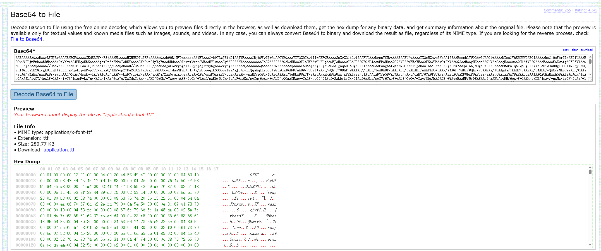
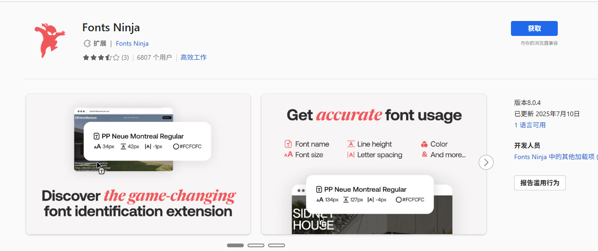
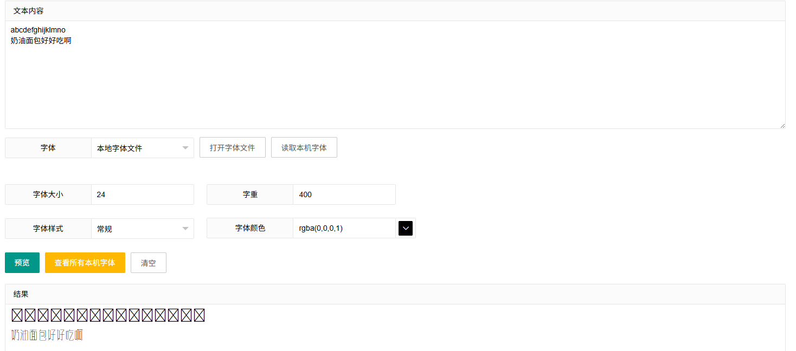

# 如何获取网页中的字体？

## 对于大多数正常网页

可以通过按F12（或++ctrl+shift+i++），访问后台，点击网络选项，就能看到字体。(没有看到的话使用++shift+f5++强制刷新一下)


点击请求URL即可下载。

但偶尔的，会遇到类似这样的东西：

```
data:font/woff;base64,d09GRgABAAAAACPsAAsAAAAAQJQAAQAAAAAAAAAAAAAAAAAAAAAAAAAAAABHU1VCAAABCAAAADMAAABCsP6z7U9TLzIAAAE8AAAARAAAAFY8e1DrY21hcAAAAYAAAAIwAAAFmOpgIzRnbHlmAAADsAAAG80AADF8VEr+y2hlYWQAAB+AAAAAMQAAADYbfVCg....

后面还有很多，有数kb多。
```


但别担心，这是base64编码后的字体文件，随便放到哪个[解码工具网站](https://base64.guru/converter/decode/file)中就能拿到字体文件了。




不过可能得到一个.bin文件，这需要你手动改一下后缀。你可以把前面一小段奇奇怪怪的字母发给ai，ai能看懂这是什么后缀的文件。

当然了，也可以使用font ninja插件（google插件），直接点击获取。大抵是不需要这样麻烦的。



> 此外就是直接读取请求到的文件，用https://github.com/google/magika识别是什么文件，这样能找到藏在一些奇奇怪怪文件中的字体文件。
> 
> 这是我目前想要做的插件。 还没有做出来,似乎还没有类似的东西出现，（查重yes），看起来模型是挂载上了，但是拉取后台不是很顺畅

## 关于怎么获取付费网站的字体。

取决于加密的方法。

我找到的两个，大家可以给我提供更多的要付费的字体网站。我可以分析一下提取方法。

## 对于发送不完整字体文件的网站https://www.hellorf.com/

这个网站（点击标题访问）支持输入文字测试并测试。是能够请求到的是不完整的woff文件的。

意味着我在预览框中输入“奶油面包好好吃啊”这句话时候，我可以在后台看到服务器发来的字体文件，这份字体文件包含“奶油面包好吃“这六个字。

如果单纯是作为标题是完全可行。但如果需要完整的字体文件，这意味着只要用脚本去把字库都上交一遍。合并出一个完整的woff。



看起来有些困难。而网站大抵是考虑到这个问题了。不过一次能拿50字，还是快的。合并字体文件的软件有没有我还没有去查过。目前还没有这样不道德的追求。

## 对于发送隐藏文件的网站https://zeenesia.com/ 

这个网站（点击标题访问），也支持它支持输入文字测试并测试。但是请求到的文件有些不一样。
你并不能在后天，网络页面中，字体选项下找到相应的字体。

经过对网页代码的分析，服务器确实发来了一个字体文件，而不是图像。换而言之我们一定能在服务器发来的文件中找到相应的字体文件。

访问后台，同样是网络页面。字体存储在一个名为tplfp***.js的文件中。


它是用base64编码的。用base64中解码即可得到文件。[解码工具网站](https://base64.guru/converter/decode/file)

你也可以让ai写个插件自动获取并转译这样的文件。

## 以纯图像发送预览的网站

例如方正字体的网站，他们的加密方式就是图像，所有的文字都是图像。没得抓取（分辨率也稀烂）。

换而言之，你需要访问小黄鱼，访问二手分发网站才能拿到字体。大抵是有的。