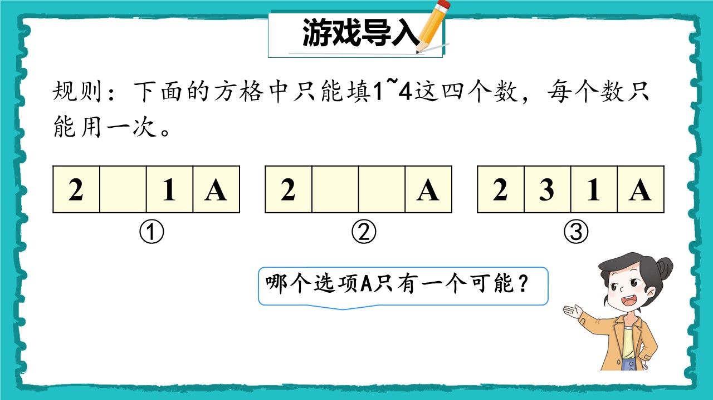
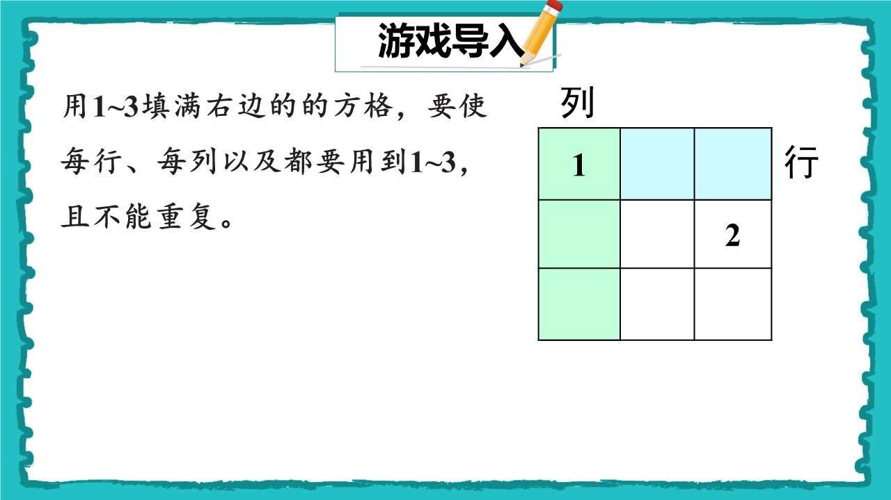
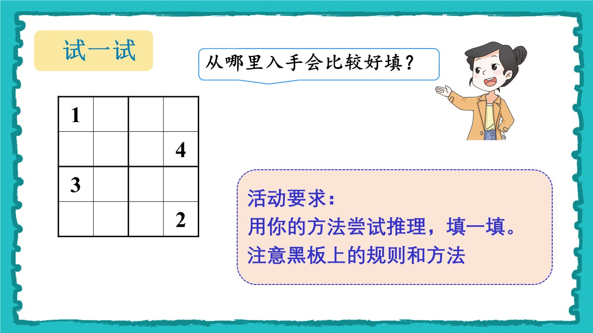

1. 1*4的行作为导入，“只能填写1-4，四个数字，不能重复”因为不能填写其他东西，所以确定的答案。提问，这里可以填写4吗？ 不行，因为不能重复

同学们想不想玩游戏。我看同学们一听到游戏就很积极。

 

今天这节课，老师我呢，给大家带来了一个游戏。来，大家看黑板，看看黑板上的这个游戏。

有没有哪个声音大，声音清晰的同学给大家读读规则？好你来读。

题目问的是什么呢？ 哪个选项A只有一种可能

同学们心中有答案了吗？ 选3，那A是几啊，是4（生），为什么呢？

因为已经有123三个数字了（生） 那为什么选项1,2不行呢？
我们先看选项1，为什么不行啊？ 因为A可以是3还可以是4（生）
那选项2呢？ 也是一样的。

2. 3*3的方格图，“只能填写一到三个数字，每行每列不能重复”，这也是类似的，但是引入了行列，通过行列确定数字。完成学习单上的小题目。

好，那老师要加大难度了 

 
同学们看黑板，同样的，有哪个声音洪亮的学生来给大家读一下规则。

嗯，读得很好。 老师有个问题要问大家，同学们知道哪个是行吗？ 这个是吗？（指竖着的） ，那么哪个是行呢？ 是这个吗？（指行），那这个行吗？（指不完整的行）
那么什么是列呢？这个是吗？有几个列？ 

好那么同学们看懂这个规则了吗？ 老师要考考大家，这个可以是2吗？（停顿）为什么不行呢？ 因为和同一行上的2重复了。那它是几呢？ 是3？为什么不能是1呢？ 因为和同一列上的1重复了。（生）

我能先填写这个位置的数吗？不能，因为信息不足，同一行，同一列上只有一个数字，它可能是 2 3 （生）

好，同学们拿出学习单，花两分钟完成一下学习单上的这一题。

巡视，指导。提示：

你打算从哪里开始填？
这个空格所在的行里已经有哪些数？
它所在的列里有哪些数？
第一个数字你是怎么推理出来的？
你能不能用“因为……所以……”说一说？

小组长帮忙巡视。

好我看同学们都能写出来这道题目，太厉害了。老师要再加大难度，看看大家能不能应对。

3. 4*4的方格图（数独），“宫内的不重复”引入宫的概念，可以通过宫和行列，确定要填写的数值。并举出反例来验证对规则的熟悉 

同学们看黑板，看看新的游戏，这个游戏叫做四乘四数独有些（板书4*4数独游戏0），看完了吗？这个游戏和刚刚的游戏有什么不同？嗯，都要求不重复。是要求什么不重复？每行，每列不重复。（板书，每行，每列，空格，不重复）

在这个游戏中，哪个是行呢？ 嗯，那么哪个是列呢？ 嗯。看来同学们都掌握了行列的知识。（点击ppt）

那么这个游戏相比刚刚的题游戏有什么不同？是四乘四的格子，能填写1到4（板书，1-4），还有呢？ 出现了一个新的概念，宫。（生）

那么什么是宫呢？老师给大家科普一下。

图中的这个被粗线围起来的部分就叫做宫。同学们听清楚了吗？ （板书，宫）

这个是宫吗？ 不是。为什么。

知道了这些概念后同学们对能看明白这个规则了吗？老师要考考大家。

这个位置可以是什么？ 2，还有其他答案吗？只能2吗？为什么呢？ 因为同一列上，有1，3了，同一行上，有4了。那这个位置呢？（另个位置，和列不相干）它可以是1吗？不行，为什么呢？因为和它同一个宫中的数字重复了。

我能从那个位置开始填写呢？ 我能从这个位置开始填写吗？ 不行，为什么？因为信息不够，那我能从什么位置开始填写？四个位置，其他位置不行吗？ 这个位置呢？ 为什么不行啊，因为这个位置只是不能填写1和4。

5. 独自完成学习单上的第一题。 随后小组讨论。教师需要巡查，提示。（问题，第一个数字是怎么推理出来的） 

看起来大家都对规则有所理解了，来，让我们来试一试这到题目吧。

来同学们先齐读白板上的要求，“用你的方法尝试推理，填一填。注意黑板上的规则和方法”

好同学们拿出学习单，完成这道题目吧。

6. 挑选学生上台，讲解步骤，思路等(讲到两个分支就能让同学归纳了，不用继续往下写)，教师负责总结，整理，引导。随后验证一下方法的理解程度。

你是从哪个空格开始填写的啊，为什么呢？因为这个位置的信息足够。有那些信息呢？这个1，3，4。1，3和它是什么关系？ 4和它是什么关系？

好继续写。同学后续写的步骤和刚刚第一步的方法本质上是一样的吗？是，为什么啊，因为都是通过找到三个确定一个的（生）。 老师我呢，给这个方法命了个名。叫做找三定一法（板书找三定一法）

有没有同学想到了不同的方法找到了数字？

有啊，嗯，你来演示一下的你的方法。

嗯，你是在这个位置有个2的时候想到了这个方法。

你可以给不能是2的地方画上×。

同学们听明白他讲的方法了吗？ 

我来考考大家。拿出学习单，看看学习单上活动2的第一题，

你能找到剩下的1吗？怎么找？一分钟时间演示给同桌看看。

找到了吗？找到的举手。是哪两个位置呢？嗯，好。看来同学们都掌握了这个方法。

8. 完成学习单上的第二个练习。教师先改小组长的练习，随后让小组长负责检验剩下人的练习。

好接下来，请同学们完成活动二。不交流不讨论。

老师巡视，并交代部分学生帮忙巡视，指出错误。

并调出学生板演。

同学们看黑板，都做对了吗？

9. 开始打.html数独游戏，四个人同台竞技

这节课的名字叫做数独游戏。老师我呢，也是借助ai给大家做了个游戏，可以让四个学生在台上同台竞技。想要玩吗？

每组挑一个。有奖励哦。

10. 总结收获

好，5678,。看大家都玩得很开心，没有玩上的也不要感到可惜。这个游戏会留在电脑上，如果还想要玩，可以和老师说一声，征求老师的同意，就能玩。

好，这节课也到了尾声。我们来个总结吧，有哪个同学能说说这节课收获了什么。开心吗？

