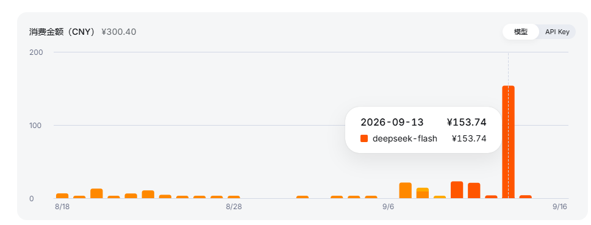

# 9 月

## 7-11 前所未有

这些天以前所未有的速度应用ai，用ai去更新mod，汉化mod，以及更重要的完善工作流。
自动化本身很舒服。

但我似乎在一定程度上对接受关注上瘾了。嗯，我是指当我把这些mod发布到论坛上，我会很想要看到别人的评论。非常非常地在意。我猜我又缺爱了。这些天也没有去领取免费的拥抱，总是工作到很晚，然后失眠，在失眠的混乱想象中滑行过这个夜晚。。

通常的，这样的情况会在一次巨大的失落后结束，但是我不希望如此。这很难受。

## 12-15 难以置信

我的导师找我，希望我能做个app，或者小程序什么的。用于打卡，打卡内容类似日记，要求兼具一定的朋友圈功能。我想了想，应该不是很麻烦。就接受了，价格低于预期也高于预期。感觉很奇怪，脑子里有两方面的声音。

总之在思考了一天，探索了很多知识后，决定使用网页先行发布，之后有余力再考虑小程序。（才不是因为小程序要审核七天交不了差）

以及花费了160块进行了失败的探索后（痛苦并快乐着可还行），脑子里才有了完整的构思。这是160块钱的token啊，一晚上全部烧干净。我过去任何时候的任何ai应用开销都要高。

花完160块钱，来到第二天的时候我有些害怕完成不了。但随后还是继续加仓，买了计划中的zcode套餐，从零构建一个网页，而非去别人的石山代码中摸索。先是做了前端demo。然后是MVP低成本验证。才总算是安定下来。

晚上时候就用空余算力去完成mod的汉化更新。自动化的感觉很舒服。

## 16 正式上线

总之今天是要交付了的。看起来token还是没有支撑到交付的时间。不过接下来应该没有这样着急了，可以慢慢维护。

### 钱与动力

这个项目目前预计要收到1000块钱。我觉得我有些惊慌失措。这个项目依照最估计大的纯成本来看，依旧有500的纯利润。

我想要拥有钱，但是同时排斥这些钱。

我并不差钱。我一直保有这样的状态。这支持我去做我任何想要做的事情而不去在意钱的事情。虽说实际上还是要在意开销，但这个心态很大程度上和我的想象隔离开来。

我过去时候担心这些钱会把我扭曲，让来自我的动力减灭。现在会好些吗？

我或许得把钱隔离开来，花在和奖励自己无关的地方。这在一定程度上或许能缓解了德西效应。

然后综合当前的消费观念，我认为目前的钱很难转换为具体的，值得称为“奖励”的内容。根本花不出去。换而言之钱目前就是个数字，不是为了某个目标熊熊燃烧燃烧的钱。我觉得很浪费，但是我目前能够用钱兑现的目标实在太少了。

此外，我认为我做这些事情不应当是为了钱而做的。作为一个契机探索一遍前后端网页构建，也是相当值得的。连同成本都不要付。因为我过去时候买的域名和服务器在买完几乎是被搁置了，而能让这些东西发挥有实的作用我就很开心了。在此基础上，付的钱不能覆盖成本也能接受。

综上我需要寻找一个结论。我该怎么给我的劳动定价？该怎么去和甲方确定价格？

距离上次有这样的想法已经过去很久了，上次是依照道德给钱即可。但是最后还是划了一个最低价，大抵是市场上能找到这个质量的公允最低价的二分之一。确保我是我，确保我是依照自己的想象去完成作品。

也因此我拥有100%的议价权--否定高价？听起来很好笑，但是一年前确实是这样的。但是直至今日，我的价格判断功能逐渐开始出现问题了，对价格高低没有那么灵敏了。而对于这种劳动定价更是模糊。

关于劳动定价，定价在大一时候是依照最低时薪去思考的。大二时候觉得不应该是这样的。时间不应该被划定价格。时间和努力程度无关